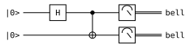
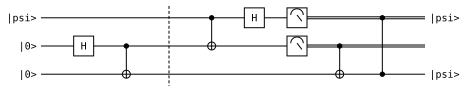
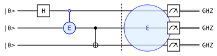
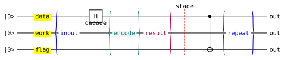
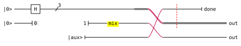

# qrab

`qrab` compiles a small, readable quantum-circuit language into standalone
LaTeX/TikZ, Typst ([Quill](https://github.com/Mc-Zen/quill)), or SVG. It is
inspired by [qpic](https://github.com/qpic/qpic), but a circuit is written as
statements in a language with types, functions, and imports rather than as
positional commands and token-substitution macros.

```qrab
circuit bell_pair {
  qubit q[2]: "|0>" -> "bell"

  h q[0]
  x q[1] if q[0]
  measure q[0], q[1]
}
```



Try it in the browser: **[playground](https://inmzhang.com/qrab/)** —
the compiler runs as WebAssembly, so nothing is uploaded and nothing is
installed.

## Features

- **Three backends from one source.** LaTeX/TikZ and Typst/Quill for papers,
  SVG for the web and for a quick look. The SVG backend needs no external
  toolchain at all.
- **Named wires, arrays, and ranges.** `qubit q[4]`, `q[0..3]`, and named
  registers instead of counting rows.
- **Real composition.** `fn`, `let`, named `style` blocks, and relative
  `import`s, all checked at compile time.
- **Structured layout.** `parallel` and `overlay` blocks, `repeat`, and
  `reverse` replay of a marked range.
- **The full qpic visual model.** Controls, boxes, measurements, swaps,
  barriers, braces, cuts, notes, groups, permutations, ellipses, wire
  lifecycle changes, and orientation.
- **Portable styling.** Twelve named colors plus hex, sizes in points, shapes,
  opacity, and hyperlinks — all of which mean the same thing in every backend.
- **Diagnostics that point at your source.** Errors carry a line, a column, a
  labelled span, and a suggestion, and one run reports more than one error.
- **Escape hatches.** `backend latex { … }` and `backend typst { … }` inject
  raw code into exactly one backend.

## Design philosophy

**A circuit is a program, not a picture.** Positional macro languages make the
easy diagram quick and the interesting diagram unmaintainable. `qrab` gives you
the constructs you already reach for — naming a thing, calling it twice,
importing it from another file — and checks that you used them correctly.

**Say it once, get every format.** The parser produces one semantic model. Each
backend renders that model; none of them can see the source text. A circuit
that compiles is a circuit every backend can draw.

**Portable styling or none at all.** Style options exist only where all
backends can honor them. Anything genuinely backend-specific goes in an
`backend` block, where it is visibly quarantined instead of silently ignored
somewhere else.

**Errors are part of the language.** Every diagnostic knows where it came
from — across `import` boundaries — and says what to do about it.

## Install

The distribution channels below are configured but stay pending until the first
public release.

| Channel | Command |
| --- | --- |
| Cargo | `cargo install qrab` |
| cargo-binstall | `cargo binstall qrab` |
| npm / Bun | `npm i -g qrab` · `npx qrab` · `bunx qrab` |
| Homebrew | `brew install --formula https://github.com/inmzhang/qrab/releases/latest/download/qrab.rb` |
| Shell | `curl --proto '=https' --tlsv1.2 -LsSf https://github.com/inmzhang/qrab/releases/latest/download/qrab-installer.sh \| sh` |
| PowerShell | `powershell -ExecutionPolicy Bypass -c "irm https://github.com/inmzhang/qrab/releases/latest/download/qrab-installer.ps1 \| iex"` |

Until then, install from a checkout:

```sh
cargo install --path . --locked
```

## Usage

```sh
qrab check circuit.qrab                      # parse and report, render nothing
qrab compile circuit.qrab                    # writes circuit.tex, circuit.typ, circuit.svg
qrab compile circuit.qrab --target svg       # writes circuit.svg
qrab compile circuit.qrab -t latex -o out.tex
```

`--target` takes `latex` (alias `tikz`), `typst` (alias `quill`), `svg`, or
`all`; `-o` requires a single backend. SVG is finished output. The other two
are sources, so hand them to their own compiler:

```sh
tectonic circuit.tex --outdir build
typst compile circuit.typ build/circuit.pdf
```

Tectonic and Typst are only needed to turn those sources into PDFs; neither is
required for `qrab check`, for source generation, or for SVG. Typst 0.15.1
downloads Quill 0.8.0 on its first build.

## Examples

Every example below is a file in [`examples/`](examples), and every diagram is
generated from it by `qrab` itself.

### Teleportation

Named wires carry their input and output labels. `if` turns any gate into a
controlled gate, `measure` switches a wire to a classical double rule, and
`barrier` separates the protocol's phases.

```qrab
circuit teleportation {
  qubit message: "|psi>" -> "|psi>"
  qubit alice: "|0>"
  qubit bob: "|0>" -> "|psi>"

  h alice
  x bob if alice
  barrier

  x alice if message
  h message
  measure message, alice
  x bob if alice
  z bob if message
}
```



### Functions, constants, and styles

`let` names a value, `style` names a set of portable style options, and `fn`
names a sequence of operations over wire parameters. Functions call functions,
and arity is checked at the call site. This is the whole point of the language:
the circuit below has one description of "entangle", used three times.

```qrab
let entangler = "E"
let accent = "#DDEEFF"

style highlighted {
  fill: accent
  stroke: blue
  shape: circle
}

fn entangle(control, target) {
  h control
  gate entangler on target if control with highlighted
}

fn prepare_ghz(first, second, third) {
  entangle(first, second)
  x third if second
  barrier
}

circuit function_composition {
  qubit q[3]: "|0>" -> "GHZ"

  prepare_ghz(q[0], q[1], q[2])
  gate entangler on q[0], q[2] with highlighted, opacity: 0.7
  measure q[0], q[1], q[2]
}
```



### Annotations

Ranges (`q[0..3]`) select several wires at once. `labels`, `brace`, `equals`,
`note`, and `cut` annotate a column without consuming one, and `layout` tunes
the shared geometry that every backend reads.

```qrab
circuit annotations {
  layout {
    gate_size: 22
    corner_radius: 3
    comment_width: 72
  }

  qubit q[3]: "|0>" -> "out"

  labels "data", "work", "flag" on q[0..3] with fill: yellow
  brace left "input" on q[0..3] with stroke: blue
  h q[0]
  note "decode" on q[1]
  equals "encode" on q[0..3] braced both with fill: "#F3F3F3", stroke: teal
  brace right "result" on q[0..3] with stroke: purple
  cut on q[0..3] as "stage" with stroke: red
  x q[2] if q[0]
  brace both "repeat" on q[0..3] with stroke: blue
}
```



### Wire lifecycle

Wires do not have to exist for the whole diagram, and they do not have to stay
in one row. `start` and `end` bound a wire's lifetime, `set … to` changes what
kind of line it draws, `bundle` marks a multiplicity, `space` reserves width,
and `permute` reorders rows for everything that follows.

```qrab
circuit lifecycle {
  layout {
    gate_size: 18
    corner_radius: 2
    comment_width: 96
  }

  qubit q[3]: "|0>" -> "out"

  start q[2] as "|aux>"
  h q[0]
  set q[1] to hidden as "0" with fill: "#F3F3F3"
  space q[1] with width: 24
  set q[1] to quantum as "1"
  bundle "3" on q[0]
  label "mix" on q[0], q[2] with fill: yellow
  set q[0] to classical
  permute q[2], q[0], q[1] with stroke: purple, width: 30
  space q[1] with width: 18, height: 8
  touch q[0], q[2] with stroke: red, dash: dashed
  end q[2] as "done"
}
```



### More

[`styling.qrab`](examples/styling.qrab) draws the same circuit top-to-bottom on
a tinted background with per-gate colors and shapes;
[`regions.qrab`](examples/regions.qrab) boxes a marked range of operations;
[`programming.qrab`](examples/programming.qrab) uses `repeat` and `reverse`;
[`measurements.qrab`](examples/measurements.qrab) covers the measurement
shapes; [`ellipsis.qrab`](examples/ellipsis.qrab) omits register rows;
[`escapes.qrab`](examples/escapes.qrab) reaches into one backend; and
[`imports.qrab`](examples/imports.qrab) pulls declarations from another file.

## Library API

`qrab::compile` is the shortest in-memory API; `load_source` expands file
imports, while `parse` and `render` expose the checked AST pipeline separately.

Public AST structs are `#[non_exhaustive]` and should be obtained through
`parse`, with public fields available for adjustments. Enums stay exhaustive so
model additions break downstream matches at compile time; before 1.0, minor
releases may make such changes.

## Documentation

**[The qrab Manual](docs/manual.pdf)** is the place to start: 42 pages covering
the language, the compiler, and the rendering model, with a worked, rendered
example for every construct. It is typeset from
[docs/manual.typ](docs/manual.typ), and every snippet in it is a real file under
[docs/manual/examples](docs/manual/examples) that `qrab` itself renders, so the
code and the picture beside it can never drift apart.

The condensed frontend reference is [docs/language.md](docs/language.md). Parity
with qpic and its evidence are tracked in
[docs/qpic-coverage.md](docs/qpic-coverage.md), and maintainers can follow
[docs/releasing.md](docs/releasing.md).

## Development

Install stable Rust, Tectonic, Typst 0.15.1, Poppler (`pdfinfo`),
[`pre-commit`](https://pre-commit.com), and `just`, then:

```sh
just install-hooks
just ci
```

`just gen-assets` regenerates the committed CLI assets and diagrams; `just
manual` does that and then typesets [docs/manual.pdf](docs/manual.pdf). CI
fails on any drift in the generated files.

The artifact suite compiles all 44 translated qpic golden tests, all 64
documented examples, and 11 focused fixtures through both Tectonic and
Typst/Quill (238 PDFs), and checks fourteen tolerant page-geometry baselines.
The SVG backend is covered by snapshots and by a well-formedness and bounds
check over every fixture. `just playground-serve` builds the WebAssembly module
and serves the playground locally.

## License

MIT. See [LICENSE](LICENSE).
